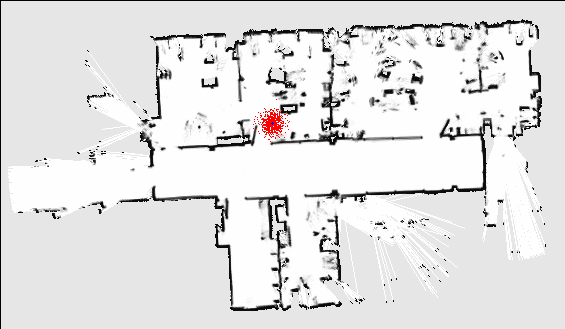
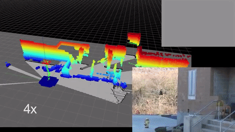
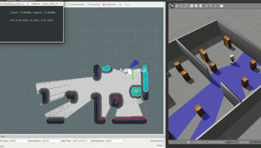

# Robotics Software Engineer
My solution for <a href="https://www.udacity.com/course/robotics-software-engineer--nd209">Robotics Software Engineer Nanodegree</a> 🤖

## Theory:

- [x] Introduction to Robotics
- [x] Gazebo World
- [x] ROS Essentials
- [x] Localization
- [x] Mapping and SLAM
- [x] Path Planning and Navigation

<table style="width:100%">
<tr>
<th>
  

  
    Introduction to Robotics
    [ <a href="./notes/Intro_Robotics.md">NOTES</a> ]
  

</th>
<th>
  

  
    Gazebo World
    [ <a href="./notes/gazebo.md">NOTES</a> ]
  

</th>
<th>
  

  
    ROS Essentials
    [ <a href="./notes/ros.md">NOTES</a> ]
  

</th>
</tr>
<tr>
<th>

  Path Planning and Navigation
  [ <a href="./notes/localization.md">NOTES</a> ]

</th>
<th>
  

  
    Mapping and SLAM
    [ <a href="./notes/mapping_slam.md">NOTES</a> ]
  

</th>
<th>
  

  
    Path Planning and Navigation
    [ <a href="./notes/planning_navigation.md">NOTES</a> ]
  

</th>
</tr>
</table>

## Projects:

- [x] Project 1 - Build My World
- [x] Project 2 - Go Chase It!
- [x] Project 3 - Where Am I
- [x] Project 4 - Map My World
- [x] Project 5 - Home Service Robot

<table style="width:100%">
<tr>
<th>
  

    Build My World
    [ <a href="#">NOTES</a> ]
  

</th>
<th>
  

    Go Chase It!
    [ <a href="#">NOTES</a> ]
  

</th>
<th>
  

    Where Am I
    [ <a href="#">NOTES</a> ]
  

</th>
</tr>
<tr>
<th>
  

    Map My World
    [ <a href="#">NOTES</a> ]
  

</th>
<th>
  

    Home Service Robot
    [ <a href="#">NOTES</a> ]
  

</th>
</tr>
</table>
