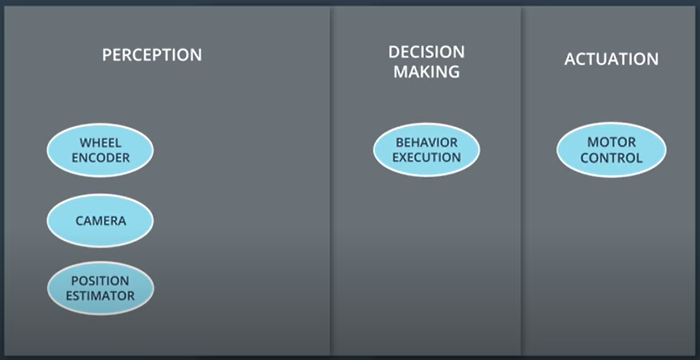
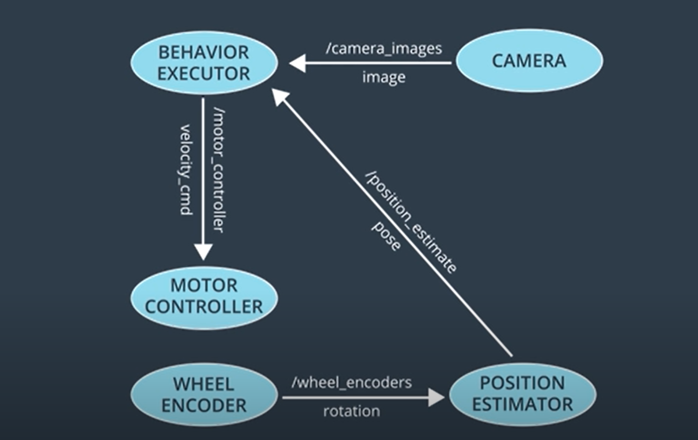

## 👾 ROS Essentials

<p align="justify">
Robot Operating System or ROS provides a means of communication with hardware. It also provides a way for different processes to communicate with one another via message passing. ROS features a slick build and package management system called <b>catkin</b>.

+ Interesting <a href="https://youtu.be/Dm7HnQb8n9Y">documentary</a> by Bloomberg.
+ ROS <a href="http://www.willowgarage.com/sites/default/files/icraoss09-ROS.pdf">paper</a>.

Almost every robot in the world uses:
- Sensors: <b>PERCEPTION</b>
- Software: <b>DECISION MAKING</b>
- Motors & Controllers: <b>ACTUATION</b>

ROS breaks down these high level tasks into small unix processes called nodes.
<center>
<a> </a>
</center>
</p>
<p align="justify">ROS master is the manager of all the nodes. ROS master maintains a registry of all the active nodes in a system. Each node can use this registry to discover other nodes and form lines of communication. ROS master also holds parameter server which holds parameters and configuration values that are shared among the running nodes. Nodes share information with each other via topics (/topic_name). In order to send a message to a node, the node must <b>publish</b> to that topic. To receive a message on a topic, a node must <b>subscribe</b> to that topic. Each node may simultaneously publish or subscribe. This network of nodes connected by topics is called a pub-sub architecture.

<b>Message Passing:</b>
There are over 200+ different predefined message types:
- <b>Physical Quantities:</b> position, velocity, acceleration, rotation, duration.
- <b>Sensor Readings:</b> laser scans, images, point clouds, inertial measurements

We can define our own message types.
Pub-Sub model is necessary but there are times when a Request-Response model is necessary. ROS provides <b>services</b>! Like topics, services allow the passing of messages between nodes. However, unlike topics, services do not have any publishers or subscribers. Instead, nodes interacts with the services on a 1:1 basis, using request and response messages.<br />
These networks of nodes are known as <b>Compute Graphs</b>! and are important. ROS provides a system called *rqt_graph* for showing the compute graph of a system.

#### Turtle Sim

The tradition of turtles in robotics is alive and well today. In fact, each recent version of ROS has been named after some sort of turtle. In addition to this turtle-centric naming convention, the Open-Source Robotics Foundation also adds a new turtle to *turtle_sim* with each release.

To check if <b>ros</b> environment has been set up correctly, we source the setup script provided by <b>ros</b> :

```
$source /opt/ros/kinetic/setup.bash

```
or type ```$ros``` followed by double tapping the tab key gives us an extensive list of all the commands beginning with their character 'ros'. Setting up the ROS environment every time you open a new terminal window can be painful and tedious. To avoid the tedium, we can simply add the command to source the workspace to our ```~/.bashrc``` file.

```
$gedit ~/.bashrc
```
To start with Turtle Sim nodes, we first need to start the <b>ros</b> master:
```
$roscore
```
In a new terminal: ( $rosrun package_name name_of_node_executable)
```
$rosrun turtlesim turtlesim_node
```
To command the turtle to move, in a new window:
```
$rosrun turtlesim turtle_teleop_key
```

##### Turtlesim Commands:

###### Turtle Sim communication Commands
- Listing all active nodes ```$rosnode list``` 'rosout' is a node automatically launched by ros for aggregating, filtering and recording log messages to a text file.
- Listing all topics ```$rostopic list```
- Getting information about topics ```$rostopic info topic_name``` e.g ```$rostopic info /turtle1/cmd_vel ```and we get the type of the message as ```geometry_msgs/Twist```
- Showing message information ```$rosmsg info geometry_msgs/Twist``` and if we need more info ```$rosed geometry_msgs Twist.msg```
- Echoing messages in real-time ```$rostopic echo``` e.g ```$rostopic echo /turtle1/cmd_vel```


</p>
