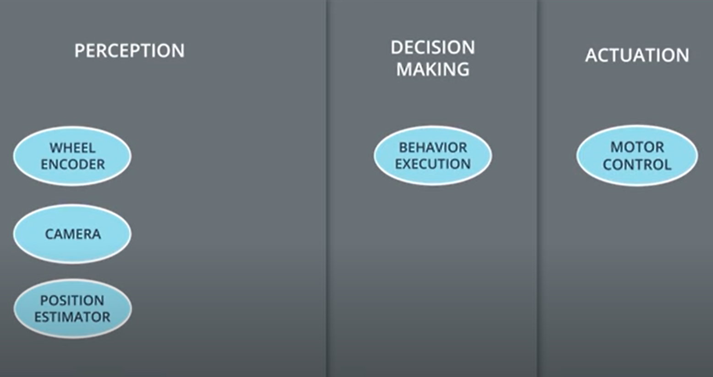

## 👾 ROS Essentials

<p align="justify">
Robot Operating System or ROS provides a means of communication with hardware. It also provides a way for different processes to communicate with one another via message passing. ROS features a slick build and package management system called <b>catkin</b>.

+ Interesting <a href="https://youtu.be/Dm7HnQb8n9Y">documentary</a> by Bloomberg.
+ ROS <a href="http://www.willowgarage.com/sites/default/files/icraoss09-ROS.pdf">paper</a>.

Almost every robot in the world uses:
- Sensors: <b>PERCEPTION</b>
- Software: <b>DECISION MAKING</b>
- Motors & Controllers: <b>ACTUATION</b>

ROS breaks down these high level tasks into small unix processes called nodes.

<a> </a>

</p>
<p align="justify">ROS master is the manager of all the nodes. ROS master maintains a registry of all the active nodes in a system. Each node can use this registry to discover other nodes and form lines of communication. ROS master also holds parameter server which holds parameters and configuration values that are shared among the running nodes. Nodes share information with each other via topics (/topic_name). In order to send a message to a node, the node must <b>publish</b> to that topic. To receive a message on a topic, a node must <b>subscribe</b> to that topic. Each node may simultaneously publish or subscribe. This network of nodes connected by topics is called a pub-sub architecture.

<b>Message Passing:</b>
There are over 200+ different predefined message types:
- <b>Physical Quantities:</b> position, velocity, acceleration, rotation, duration.
- <b>Sensor Readings:</b> laser scans, images, point clouds, inertial measurements

We can define our own message types.
Pub-Sub model is necessary but there are times when a Request-Response model is necessary. ROS provides <b>services</b>! Like topics, services allow the passing of messages between nodes. However, unlike topics, services do not have any publishers or subscribers. Instead, nodes interacts with the services on a 1:1 basis, using request and response messages.<br />
These networks of nodes are known as <b>Compute Graphs</b>! and are important. ROS provides a system called *rqt_graph* for showing the compute graph of a system.

#### Turtle Sim

The tradition of turtles in robotics is alive and well today. In fact, each recent version of ROS has been named after some sort of turtle. In addition to this turtle-centric naming convention, the Open-Source Robotics Foundation also adds a new turtle to *turtle_sim* with each release.

To check if <b>ros</b> environment has been set up correctly, we source the setup script provided by <b>ros</b> :

```
$ source /opt/ros/kinetic/setup.bash

```
or type ```$ ros``` followed by double tapping the tab key gives us an extensive list of all the commands beginning with their character 'ros'. Setting up the ROS environment every time you open a new terminal window can be painful and tedious. To avoid the tedium, we can simply add the command to source the workspace to our ```~/.bashrc``` file.

```
$ gedit ~/.bashrc
```
To start with Turtle Sim nodes, we first need to start the <b>ros</b> master:
```
$ roscore
```
In a new terminal: ( ```$ rosrun package_name name_of_node_executable```)
```
$ rosrun turtlesim turtlesim_node
```
To command the turtle to move, in a new window:
```
$ rosrun turtlesim turtle_teleop_key
```

##### Turtlesim Commands:

###### Turtle Sim communication Commands
- Listing all active nodes ```$ rosnode list``` 'rosout' is a node automatically launched by ros for aggregating, filtering and recording log messages to a text file.
- Listing all topics ```$ rostopic list```
- Getting information about topics ```$ rostopic info topic_name``` e.g ```$ rostopic info /turtle1/cmd_vel ```and we get the type of the message as ```geometry_msgs/Twist```
- Showing message information ```$ rosmsg info geometry_msgs/Twist``` and if we need more info ```$ rosed geometry_msgs Twist.msg```
- Echoing messages in real-time ```$ rostopic echo``` e.g ```$ rostopic echo /turtle1/cmd_vel```

#### Packages & Catkin Workspaces

A catkin workspace is a top-level directory where you build, install, and modify catkin packages. Each package also contains a file with build instructions - the CMakeLists.txt file - and a package.xml file with information about the package. Packages enable ROS users to organize useful functionality in a convenient and reusable format.
We need to create the top level catkin workspace directory and a sub-directory named ```src```:

```
$ mkdir -p /home/workspace/catkin_ws/src
```
then ``` $ cd /home/workspace/catkin_ws/src ```

Now we can initialize the catkin workspace which will create a CMakeLists.txt file:

``` $ catkin_init_workspace ``` and this creates a symbolic link to ```/opt/ros/kinetic/share/catkin/cmake/toplevel.cmake```

Next return to top level directory ```$ cd /home/workspace/catkin_ws``` and build the workspace:

```$ catkin_make```   More on catkin - <a href="http://wiki.ros.org/catkin/conceptual_overview">ROSWiki :: catkin</a>

<br />

Two new directories are formed ```build``` and ```devel```. The aptly named ```build``` directory is the build space for C++ packages. The ```devel``` directory does contain something of interest, a file named ```setup.bash```. This ```setup.bash``` script must be sourced before using the catkin workspace with ```source devel/setup.bash```.

###### + Adding a package
Navigate to the ```src``` directory of catkin workspace and then clone an existing package:

```
$ cd /home/workspace/catkin_ws/src/
$ git clone -b first_interaction https://github.com/udacity/RoboND-simple_arm/ simple_arm
```
To build the new package:

```
$ cd /home/workspace/catkin_ws/
$ catkin_make
```
In case of missing package error while building the catkin workspace - <b>"Could not find a package configuration file provided by controller_manager"</b>

```
$ sudo apt-get install ros-kinetic-controller-manager
```
##### ROSLAUNCH

```roslaunch``` allows us to do the following:
- Launch the ROS Master and multiple nodes with one simple command
- Set default parameters on the parameter server
- Automatically re-spawn processes that have died

To use roslaunch, we must first make sure that your workspace has been built and sourced
```
$ cd /home/workspace/catkin_ws/
$ catkin_make
```
and ```$ source devel/setup.bash```. Now we can make use of ```roslaunch```

```
$ roslaunch simple_arm robot_spawn.launch
```

##### ROS Package Dependencies (Rosdep)

ROS packages have two types of dependencies: <b>build dependencies</b> and <b>run dependencies</b>. The ```rosdep``` tool will check for a package's missing dependencies, download them, and install them.

To check for missing dependencies in a ROS package:
```
$ rosdep check <package name>
```
to install the dependencies ``` $ rosdep install -i <package name> ```

###### Creating own catkin-package

To create personal packages, go to ```$ cd /home/workspace/catkin_ws/src``` The syntax for creating a catkin package is:

```
$ catkin_create_pkg <your_package_name> [dependency1 dependency2 …]
```
Navigating inside our newly created package reveals that it contains just two files: ```CMakeLists.txt``` and ```package.xml```

ROS packages have a conventional directory structure. Let’s take a look at a more typical package.

- scripts (python executables)
- src (C++ source files)
- msg (for custom message definitions)
- srv (for service message definitions)
- include -> headers/libraries that are needed as dependencies
- config -> configuration files
- launch -> provide a more automated way of starting nodes

Other folders may include
- urdf (Universal Robot Description Files)
- meshes (CAD files in .dae (Collada) or .stl (STereoLithography) format)
- worlds (XML like files that are used for Gazebo simulation environments)

List of <a href="https://www.ros.org/browse/list.php">ros kinetic packages</a>.

#### Write ROS nodes

Write nodes in C++. The first node that you will write is called ```simple_mover```. The ```simple_mover``` node does nothing more than publish joint angle commands to ```simple_arm```. We will write another node ```arm_mover```. The ```arm_mover``` node provides a service called ```safe_move```, which allows the arm to be moved to any position within its workspace that has been deemed safe. The safe zone is bounded by minimum and maximum joint angles, and is configurable via the ROS parameter server.

The last node we’ll write in this lesson is the ```look_away``` node.


</p>
